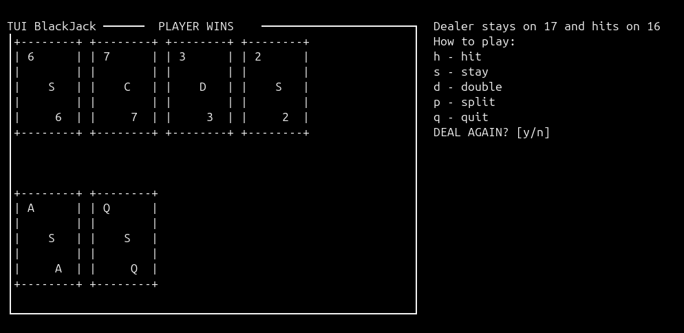

## TUI-INFINITE-BlackJack ♠️♥️

BlackJack or 21 cards game with text user interface to be played in the terminal, made completly in c++ with the `ncurses` library. In this game there is an infinite numbers of packs so good luck card counting :)). Not every terminal supports symbols so i have C- clubs, S - spades, H - hearts and D - diamonds

---------------------------------------------------------------------------------------

## Dependences
 - `lncurses` c/c++ library
 -  compiler suited for c++ (I reccomend g++)
 -  to be openned in terminal

## How to play
**On linux/macOS**  
 - `git clone` the repo or install the zip
 - compile the `.cpp` file ( `g++ blackjack.cpp -o blackjack -lncurses ` )
 - `./blackjack`
 -  h - hit
 -  s - stay
 -  q - quit
 -  y/n for another hand 
 
-------------------------------------------

 **On Android** 
 - install Termux from the play store  git clone it like before and inside paste:
 - `pkg update && pkg upgrade && pkg install clang`
 -  ` clang++ blackjack.cpp -o blackjack -lncurses && ./blackjack`

----------------------------------------------------

I am still working on the game so there is no *double down* or *split* and the UI may bug rarely.

Besides *double down* and *split* i want to add side bets like *crazy seven*, *21 + 3* and *bust* also a cash system maybe with a json so the player wont loose the cash and improve the ACE score by calculating it recursively.

